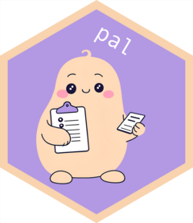

<!-- README.md is generated from README.Rmd. Please edit that file -->

# chores 

<!-- badges: start -->

[](https://lifecycle.r-lib.org/articles/stages.html#experimental)
[](https://CRAN.R-project.org/package=chores)
[](https://github.com/simonpcouch/chores/actions/workflows/R-CMD-check.yaml)
<!-- badges: end -->

The chores package provides a library of ergonomic LLM assistants
designed to help you complete repetitive, hard-to-automate tasks
quickly. After selecting some code, press the keyboard shortcut you’ve
chosen to trigger the chores addin (we suggest `Ctrl+Cmd+C`), select the
helper, and watch your code be rewritten.

> This package used to be called pal.

## Installation

Getting started with chores takes three steps.

**1)** Install the chores package like so:

``` r
pak::pak("simonpcouch/chores")
```

**2)** Then, you need to configure chores with an
[ellmer](https://ellmer.tidyverse.org/) model. chores uses ellmer under
the hood, so any model that you can chat with through ellmer is also
supported by chores. To configure chores with ellmer, set the option
`.chores_chat` to any ellmer Chat. For example, to use Claude, you’d
write `options(.chores_chat = ellmer::chat_claude())`, possibly in your
`.Rprofile` so that chores is ready to go every time you start R. To
learn more, see the [Getting started with
chores](https://simonpcouch.github.io/chores/articles/chores.html)
vignette.

**3)** Chore helpers are interfaced with the via the chores addin. For
easiest access, we recommend registering the chores addin to a keyboard
shortcut.

**In RStudio**, navigate to
`Tools > Modify Keyboard Shortcuts > Search "Chores"`—we suggest
`Ctrl+Alt+C` (or `Ctrl+Cmd+C` on macOS).

**In Positron**, you’ll need to open the command palette, run “Open
Keyboard Shortcuts (JSON)”, and paste the following into your
`keybindings.json`:

``` json
    {
        "key": "Ctrl+Cmd+C",
        "command": "workbench.action.executeCode.console",
        "when": "editorTextFocus",
        "args": {
            "langId": "r",
            "code": "chores::.init_addin()",
            "focus": true
        }
    }
```

The analogous keybinding on non-macOS is `Ctrl+Alt+C`. That said, change
the `"key"` entry to any keybinding you wish!

Once those steps are completed, you’re ready to use helpers with a
keyboard shortcut.

## Example

Chore helpers are created automatically when users interact with the
chores addin. Just highlight some code, open the addin, begin typing the
“chore” of your chores and press “Return”, and watch your code be
rewritten:


As-is, the package provides ergonomic LLM assistants for R package
development:

- `"cli"`: [Convert to
  cli](https://simonpcouch.github.io/chores/reference/cli_helper.html)
- `"testthat"`: [Convert to testthat
  3](https://simonpcouch.github.io/chores/reference/testthat_helper.html)
- `"roxygen"`: [Document functions with
  roxygen](https://simonpcouch.github.io/chores/reference/roxygen_helper.html)

Users have also contributed a number of helpers for a wide range of
tasks–see `vignette("gallery", package = "chores")` for a gallery of
user-contributed helpers!

That said, all you need to create your own chore helper is a markdown
file with some instructions on how you’d like it to work. See
`prompt_new()` and `directory_load()` for more information, and
[chorespable](https://github.com/simonpcouch/chorespable) for an example
chores extension package.

## How much do helpers cost?

The cost of using helpers depends on 1) the length of the underlying
prompt for a given helper and 2) the cost per token of the chosen model.
Using the cli helper with Anthropic’s Claude Sonnet 3.5, for example,
[costs something
like](https://simonpcouch.github.io/chores/reference/cli_helper.html#cost)
\$15 per 1,000 code refactorings, while using the testthat helper with
OpenAI’s GPT 4o-mini would cost something like \$1 per 1,000
refactorings. Chore helpers using a locally-served LLM are “free” (in
the usual sense of code execution, ignoring the cost of increased
battery usage).
