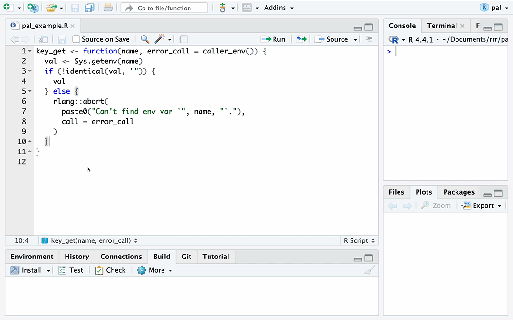

<!-- README.md is generated from README.Rmd. Please edit that file -->

# Your pal 

<!-- badges: start -->

[](https://lifecycle.r-lib.org/articles/stages.html#experimental)
[](https://CRAN.R-project.org/package=pal)
<!-- badges: end -->

Pals are persistent, ergonomic LLM assistants designed to help you
complete repetitive, hard-to-automate tasks quickly. When created, they
automatically generate RStudio add-ins registered to keyboard shortcuts.
After selecting some code, press the keyboard shortcut you’ve chosen and
watch your code be rewritten.

**Much of the documentation in this package is aspirational and its
interface is likely to change rapidly.**

## Installation

You can install pal like so:

``` r
pak::pak("simonpcouch/pal")
```

Then, ensure that you have an `ANTHROPIC_API_KEY` set in your
[`.env`](https://github.com/gaborcsardi/dotenv). If you’d like to use an
LLM other than Anthropic’s Claude 3.5 Sonnet to power the pal, see
`?pal()` to set default metadata on that model.

## Example

To create a pal, simply pass `pal()` a pre-defined “role” and a
keybinding you’d like it attached to. For example, to use the cli pal:

``` r
pal("cli", "Ctrl+Shift+C")
```

Then, highlight some code, press the keyboard shortcut, and watch your
code be rewritten:

 As-is, the package provides ergonomic LLM
assistants for R package development:

- `"cli"`: Convert to cli
- `"testthat"`: Convert to testthat 3
- `"roxygen"`: Document functions with roxygen

That said, the package provides infrastructure for others to make LLM
assistants for any task in R, from authoring to interactive data
analysis. With only a markdown file and a function call, users can
extend pal to assist with their own repetitive but hard-to-automate
tasks.
